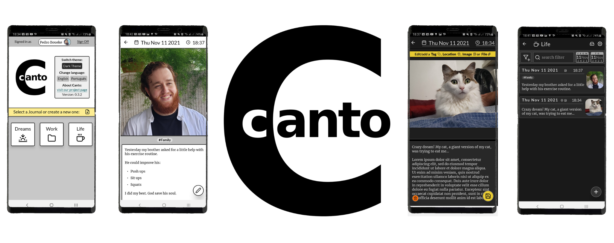

<p align="center"></p>

&nbsp;

## **WIP:** See the road map on this readme file

&nbsp;

# About

Canto is am entirely free, simple journaling app for Android. 
It's built with `react-native` and may one day be ported to *ioPs*. 
It's meant to resolve frustrations with the current *journaling mobile app*
ecosystem - pointless features, insane charges and 'DiaryAsAService'-bs.

Features:

* Completely **free and open source**
* Management of **multiple journals**
* **Encryption**. Always. Everywhere.
* **Automated backups** with Google Drive

&nbsp;


# Contributing

## BUG REPORT

Please [create an issue](https://github.com/pboueke/canto/issues) tagged as `bug`. Include the platform, a description of the problem and how to reproduce it. 

&nbsp;

## Fixes, improvements, features

Please [create an issue](https://github.com/pboueke/canto/issues) for discussing the changes. If all is well, your PR will be merged once reviwed.

&nbsp;

# Roadmap

First release:

* (being worked at) Finish Google Drive Integration for automated backups.
   * Fix uploaded image download/upload (currently receiving empty data array from API)
   * Check for bugs

* Add option to create readable exports of a journal (doc or markdown file)
* Add option to generate local exports that can be used as backups
* Add option to load local exports
* Add loading spin in areas it's needed
* General compatibility test on other android API levels and devices

Long term support:
* Tests, none currently exists.
* Migrate to TypeScript. 


&nbsp;

# Development

1. Connect your phone or emulator using Android Studio

2. Run JS Server on a terminal 

*Console #1*
```
> yarn start 
```

3. Compile and install Canto

*Console #2*
```
> yarn android
```

&nbsp;


# Google Drive Integration

Install [react-native-google-signin](https://github.com/react-native-google-signin/google-signin) and [react-native-google-drive-api-wrapper](https://github.com/RobinBobin/react-native-google-drive-api-wrapper/tree/master/src#list_query_builder). Make sure your app SHA1 fingerprint is properly setup. 

Create a project at Google's API console, adding an OAuth 2.0 **web** credential. Save it to a `gdriveCredentials.js` file at this project root directory. Just export the credential json: `export default {/* json credentials data */}`.

Remember to enable access to the [Google Drive API](https://developers.google.com/drive/api/v3/enable-drive-api).

&nbsp;

# Build

## Android

### Issues derived from `mmkv-storage` 

This project uses [react-native-mmkv-storage](https://github.com/ammarahm-ed/react-native-mmkv-storage). If the  project wont build after following the [installation instrunctions](https://rnmmkv.vercel.app/#/gettingstarted), check the [related issue](https://github.com/pboueke/canto/issues/1).

&nbsp;