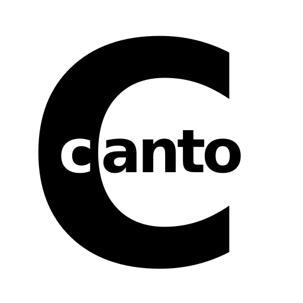

<p align="center"></p>

# About

Canto is am entirely free, simple journaling app for Android. 
It's built with `react-native` and may one day be ported to *ios*. 
It's meant to resolve frustrations with the current *journaling mobile app*
ecosystem - pointless features, insane charges and 'DiaryAsAService'-bs.

Features:

* Completely free and open source
* Management of multiple journals
* Local encryption
* Automated backups with Drive

&nbsp;

---

# Development

1. Connect your phone or emulator using Android Studio

2. Run JS Server on a terminal 

*Console #1*
```
> yarn start 
```

3. Compile and install Canto

*Console #2*
```
> yarn android
```

&nbsp;

---

# Google Drive Integration

Install [react-native-google-signin](https://github.com/react-native-google-signin/google-signin) and [react-native-google-drive-api-wrapper](https://github.com/RobinBobin/react-native-google-drive-api-wrapper/tree/master/src#list_query_builder). Make sure your app SHA1 fingerprint is properly setup. 

Create a project at Google's API console, adding an OAuth 2.0 **web** credential. Save it to a `gdriveCredentials.js` file at this project root directory. Just export the credential json: `export default {/* json credentials data */}`.

Remember to enable access to the [Google Drive API](https://developers.google.com/drive/api/v3/enable-drive-api).

&nbsp;

---

# Build

## Android

### Issues derived from `mmkv-storage` 

This project uses [react-native-mmkv-storage](https://github.com/ammarahm-ed/react-native-mmkv-storage). If the  project wont build after following the [installation instrunctions](https://rnmmkv.vercel.app/#/gettingstarted), check the [related issue](https://github.com/pboueke/canto/issues/1).

&nbsp;